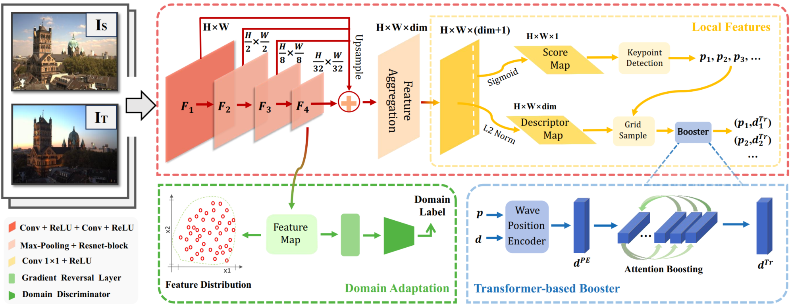








I am pursuing my B.Eng degree in Automation at Southeast University, supervised by Prof.[Songlin Du](https://songlin.ac.cn/). Besides, I am an incoming Ph.D. student in Conrol Science and Engineering at Zhejiang University, supervised by Prof.[Wenchao Meng](https://scholar.google.com/citations?hl=zh-CN&user=OiQ2UisAAAAJ).

My research interest includes deep learning, computer vision and LLM. 

<!-- # 🔥 News
- *2022.02*: &nbsp;🎉🎉 Lorem ipsum dolor sit amet, consectetur adipiscing elit. Vivamus ornare aliquet ipsum, ac tempus justo dapibus sit amet. 
- *2022.02*: &nbsp;🎉🎉 Lorem ipsum dolor sit amet, consectetur adipiscing elit. Vivamus ornare aliquet ipsum, ac tempus justo dapibus sit amet.  -->

# 📝 Publications 

ICONIP 2024

[RADA: Robust and Accurate Feature Learning with Domain Adaptation](https://arxiv.org/abs/2407.15791)

**Jingtai He**, Gehao Zhang, Tingting Liu, Songlin Du

[**Project**](https://github.com/withTai/RADA) <strong></strong>
- RADA is a multi-level feature aggregation network that incorporates two pivotal components to facilitate the learning of robust and accurate features with domain adaptation. 

# 📝 Preprints

IEEE T-CSVT

[DiD: Domain-invariant Descriptor for Sparse Image Matching](https://arxiv.org/abs/2407.15791)

Tingting Liu, Xiaoyong Lu, **Jingtai He**, Songlin Du

[**Project**](https://github.com/withTai/RADA) <strong></strong>
- DiD is a domain adaptive image matching network, including domain information filtering, descriptor-based distribution alignment and descriptor significance consolidation. 

<!-- - [Lorem ipsum dolor sit amet, consectetur adipiscing elit. Vivamus ornare aliquet ipsum, ac tempus justo dapibus sit amet](https://github.com), A, B, C, **CVPR 2020** -->

# 🎖 Honors and Awards
- SEU Presidential Scholarship, 2024 
- SEU Perfection Student Scholarship, 2022, 2023, 2024 
<!-- - *2021.09* Lorem ipsum dolor sit amet, consectetur adipiscing elit. Vivamus ornare aliquet ipsum, ac tempus justo dapibus sit amet.  -->

# 📖 Educations
- *2025.06 - 2030 (now)*, Ph.D., Control Science and Engineering, Zhejiang University, Hangzhou. 
- *2021.09 - 2025.06*, Undergraduate, Automation, Southeast Univeristy, Nanjing. 

<!-- # 💬 Invited Talks
- *2021.06*, Lorem ipsum dolor sit amet, consectetur adipiscing elit. Vivamus ornare aliquet ipsum, ac tempus justo dapibus sit amet. 
- *2021.03*, Lorem ipsum dolor sit amet, consectetur adipiscing elit. Vivamus ornare aliquet ipsum, ac tempus justo dapibus sit amet.  \| [\[video\]](https://github.com/)

# 💻 Internships
- *2019.05 - 2020.02*, [Lorem](https://github.com/), China. -->